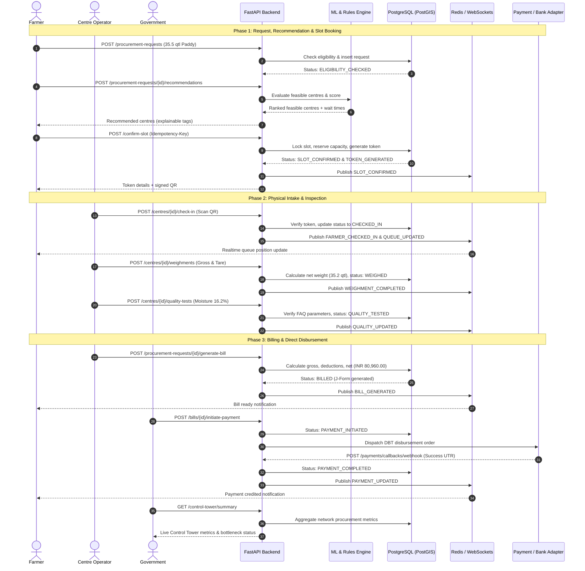

# KISANQUEUE V2 — API Contract

## 1. Contract Status

Version:

`v2.0`

Status:

`FOUNDATION CONTRACT`

Base path:

`/api/v1`

The API version remains `/v1` for backward compatibility while the internal architecture is upgraded to KISANQUEUE V2.

Breaking API changes require a new API version.

---

## 2. Core API Principles

1. **Backend is the single source of truth**: All operational and business state is owned, validated, and persisted by the backend in PostgreSQL.
2. **Frontends never access PostgreSQL directly**: All client portals (Farmer, Operator, Government) communicate strictly via versioned HTTP REST and WebSocket APIs.
3. **All business rules are enforced server-side**: Client applications render UI; they do not dictate business logic, eligibility, or capacity.
4. **Authentication and authorization are enforced server-side**: Role-Based Access Control (RBAC) and resource ownership boundaries are strictly validated on every request.
5. **ML predictions cannot override hard constraints**: Machine learning informs recommendations and forecasts, but deterministic business rules always decide. Feasibility precedes optimization.
6. **Financial calculations are performed exclusively by the backend**: Procurement rates, moisture/quality deductions, gross amounts, and net disbursements are calculated using decimal-safe arithmetic on the server.
7. **Workflow transitions are controlled by the backend**: Entities progress through a strict finite state machine. Clients cannot supply arbitrary state mutations.
8. **Retryable mutations support idempotency**: State-altering endpoints support the `Idempotency-Key` header to safely handle retries, network hiccups, and offline synchronization.
9. **Realtime events supplement REST APIs**: WebSockets deliver immediate notifications and queue updates, but PostgreSQL remains the durable system of record.
10. **Errors use stable machine-readable error codes**: All failures return standard JSON error structures with predictable codes, human-friendly messages, and contextual details.

---

## 3. Roles

KISANQUEUE defines three authoritative operational roles:

```text
FARMER
CENTRE_OPERATOR
GOVERNMENT
```

### Role Capabilities and Token Scopes:

| Role | Scope | Permitted Operations |
|---|---|---|
| `FARMER` | `farmer` | Manage own profile, create procurement requests, view recommendations, book/reschedule slots, view digital token & QR, inspect personal queue position, view bills, track payment status. |
| `CENTRE_OPERATOR` | `operator` | Assigned to specific `centre_id`. Check in farmers via QR/Token, record weighbridge weights, submit quality testing results, manage centre operational status (open/delay/pause), submit offline sync batches. |
| `GOVERNMENT` | `government` | Jurisdictional/System-wide oversight. Access Government Control Tower, monitor network KPIs, view cross-centre queue pressure, trigger/approve centre reassignments, adjust capacity buffers, inspect immutable audit logs. |

Every authenticated request carries a JWT token with claims: `sub` (user UUID), `role` (`FARMER` | `CENTRE_OPERATOR` | `GOVERNMENT`), `centre_id` (for operators), and `jurisdiction_id` (for government officials).

---

## 4. Authentication

All authentication endpoints are located under `/api/v1/auth`. Authentication is passwordless for farmers (SMS OTP) and role-secured for operators and administrators.

### 4.1 Request OTP

- **Endpoint**: `POST /api/v1/auth/otp/request`
- **Auth**: Public (Rate-limited: 5 requests / 15 minutes / IP / Phone)
- **Request Body**:
  ```json
  {
    "phone_number": "+919876543210",
    "role": "FARMER"
  }
  ```
- **Response**: `200 OK`
  ```json
  {
    "success": true,
    "data": {
      "session_id": "7b8d80f0-c112-4c4f-9ef1-bf87bc00298a",
      "expires_in_seconds": 300,
      "message": "OTP sent successfully to registered mobile number"
    }
  }
  ```

### 4.2 Verify OTP

- **Endpoint**: `POST /api/v1/auth/otp/verify`
- **Auth**: Public
- **Request Body**:
  ```json
  {
    "session_id": "7b8d80f0-c112-4c4f-9ef1-bf87bc00298a",
    "phone_number": "+919876543210",
    "otp_code": "452819"
  }
  ```
- **Response**: `200 OK`
  ```json
  {
    "success": true,
    "data": {
      "access_token": "eyJhbGciOiJIUzI1NiIsInR5cCI6IkpXVCJ9...",
      "refresh_token": "def50200b301...",
      "token_type": "Bearer",
      "expires_in": 3600,
      "user": {
        "user_id": "4a713838-5182-4f32-9ecb-01a14c330f6d",
        "role": "FARMER",
        "farmer_id": "8f81f1b2-c045-4df3-a53b-e01d3b070449",
        "name": "Ramesh Patel",
        "phone_number": "+919876543210",
        "is_profile_complete": true
      }
    }
  }
  ```

### 4.3 Refresh Token

- **Endpoint**: `POST /api/v1/auth/refresh`
- **Auth**: Bearer Refresh Token
- **Request Body**:
  ```json
  {
    "refresh_token": "def50200b301..."
  }
  ```
- **Response**: `200 OK` (returns fresh `access_token` and `refresh_token`).

### 4.4 Logout

- **Endpoint**: `POST /api/v1/auth/logout`
- **Auth**: Bearer Access Token
- **Response**: `200 OK` (token revoked / blacklisted).

---

## 5. Farmer Profile

Manages farmer demographic, landholding, and disbursement information.

### 5.1 Get Current Farmer Profile

- **Endpoint**: `GET /api/v1/farmers/me`
- **Auth**: `FARMER`
- **Response**: `200 OK`
  ```json
  {
    "success": true,
    "data": {
      "farmer_id": "8f81f1b2-c045-4df3-a53b-e01d3b070449",
      "user_id": "4a713838-5182-4f32-9ecb-01a14c330f6d",
      "name": "Ramesh Patel",
      "phone_number": "+919876543210",
      "aadhaar_masked": "XXXX-XXXX-4589",
      "district": "Karnal",
      "state": "Haryana",
      "village": "Taraori",
      "location": {
        "latitude": 29.8015,
        "longitude": 76.9242
      },
      "land_holding_hectares": 2.5,
      "bank_details": {
        "bank_name": "State Bank of India",
        "account_number_masked": "XXXXXXXX4821",
        "ifsc_code": "SBIN0001234"
      },
      "created_at": "2026-08-10T09:00:00Z"
    }
  }
  ```

### 5.2 Update Farmer Profile

- **Endpoint**: `PUT /api/v1/farmers/me`
- **Auth**: `FARMER`
- **Request Body**:
  ```json
  {
    "village": "Taraori",
    "location": {
      "latitude": 29.8015,
      "longitude": 76.9242
    },
    "land_holding_hectares": 2.5,
    "bank_details": {
      "bank_name": "State Bank of India",
      "account_number": "00000031892834821",
      "ifsc_code": "SBIN0001234"
    }
  }
  ```
- **Response**: `200 OK` (returns updated profile with masked sensitive data).

### 5.3 View Farmer by ID (Operator / Government)

- **Endpoint**: `GET /api/v1/farmers/{farmer_id}`
- **Auth**: `CENTRE_OPERATOR`, `GOVERNMENT`
- **Response**: `200 OK` (Farmer summary without sensitive raw credentials).

---

## 6. Procurement Requests

Farmers initiate procurement intent by creating a procurement request.

### 6.1 Create Procurement Request

- **Endpoint**: `POST /api/v1/procurement-requests`
- **Auth**: `FARMER`
- **Header**: `Idempotency-Key: <UUID>`
- **Request Body**:
  ```json
  {
    "commodity_code": "PADDY_COMMON",
    "crop_variety": "PR-126",
    "estimated_quantity_qtl": 35.5,
    "harvest_date": "2026-09-20",
    "preferred_date": "2026-09-25",
    "preferred_radius_km": 25.0,
    "farmer_location": {
      "latitude": 29.8015,
      "longitude": 76.9242
    }
  }
  ```
- **Backend Rules**:
  1. Validates quantity in quintals (`qtl > 0` and within allowed landholding quota).
  2. Automatically executes deterministic eligibility check.
  3. Sets state to `REQUESTED`, then transitions to `ELIGIBILITY_CHECKED`.
- **Response**: `201 Created`
  ```json
  {
    "success": true,
    "data": {
      "procurement_request_id": "1e2f3a4b-5c6d-7e8f-9a0b-1c2d3e4f5a6b",
      "farmer_id": "8f81f1b2-c045-4df3-a53b-e01d3b070449",
      "commodity_code": "PADDY_COMMON",
      "crop_variety": "PR-126",
      "estimated_quantity_qtl": 35.5,
      "preferred_date": "2026-09-25",
      "status": "ELIGIBILITY_CHECKED",
      "is_eligible": true,
      "eligibility_remarks": "Passed land quota and registration validation",
      "created_at": "2026-09-17T11:00:00Z"
    }
  }
  ```

### 6.2 List Procurement Requests

- **Endpoint**: `GET /api/v1/procurement-requests`
- **Auth**: `FARMER` (lists own), `GOVERNMENT` (filterable)
- **Query Parameters**: `status`, `page`, `page_size`, `date_from`, `date_to`
- **Response**: `200 OK` (Paginated list of procurement requests).

### 6.3 Get Procurement Request Details

- **Endpoint**: `GET /api/v1/procurement-requests/{request_id}`
- **Auth**: `FARMER` (owner), `CENTRE_OPERATOR`, `GOVERNMENT`
- **Response**: `200 OK` (Full request lifecycle details, slot, token, weighment, quality, bill).

### 6.4 Cancel Procurement Request

- **Endpoint**: `POST /api/v1/procurement-requests/{request_id}/cancel`
- **Auth**: `FARMER`, `GOVERNMENT`
- **Header**: `Idempotency-Key: <UUID>`
- **Request Body**:
  ```json
  {
    "cancellation_reason": "Crop not ready for harvest"
  }
  ```
- **Rule**: Allowed only before `CHECKED_IN` state. Releases any reserved slot capacity.
- **Response**: `200 OK` (Status updated to `CANCELLED`).

---

## 7. Centre Recommendations

Provides an intelligent, ranked list of feasible procurement centres.

### 7.1 Generate Centre Recommendations

- **Endpoint**: `POST /api/v1/procurement-requests/{request_id}/recommendations`
- **Auth**: `FARMER` (owner), `GOVERNMENT`
- **Request Body**:
  ```json
  {
    "max_distance_km": 30.0,
    "target_date": "2026-09-25"
  }
  ```
- **Response**: `200 OK`
  ```json
  {
    "success": true,
    "data": {
      "procurement_request_id": "1e2f3a4b-5c6d-7e8f-9a0b-1c2d3e4f5a6b",
      "requested_quantity_qtl": 35.5,
      "recommended_centres": [
        {
          "centre_id": "c1112222-3333-4444-5555-666677778888",
          "centre_name": "Karnal Central Mandi - Gate 2",
          "district": "Karnal",
          "distance_km": 11.4,
          "is_feasible": true,
          "recommendation_score": 92.4,
          "predicted_wait_time_minutes": 25,
          "predicted_processing_time_minutes": 18,
          "queue_pressure": "LOW",
          "available_capacity_qtl": 420.0,
          "available_slots_count": 4,
          "recommendation_tags": [
            "LOW_QUEUE_PRESSURE",
            "OPTIMAL_DISTANCE",
            "HIGH_THROUGHPUT"
          ],
          "explanation": "Centre has ample storage capacity, low current queue pressure, and an estimated wait time of only 25 minutes."
        },
        {
          "centre_id": "c9998888-7777-6666-5555-444433332222",
          "centre_name": "Taraori Grain Hub",
          "district": "Karnal",
          "distance_km": 4.2,
          "is_feasible": true,
          "recommendation_score": 78.1,
          "predicted_wait_time_minutes": 85,
          "predicted_processing_time_minutes": 22,
          "queue_pressure": "HIGH",
          "available_capacity_qtl": 80.0,
          "available_slots_count": 1,
          "recommendation_tags": [
            "NEAREST_CENTRE",
            "HEAVY_QUEUE_LOAD"
          ],
          "explanation": "Nearest centre, but experiences heavy queue load today with an estimated wait time of 85 minutes."
        }
      ]
    }
  }
  ```

---

## 8. Recommendation Rules

The recommendation engine strictly enforces a sequential pipeline:

```text
1. Eligibility
      ↓
2. Operational Status
      ↓
3. Commodity Compatibility
      ↓
4. Hard Capacity Feasibility
      ↓
5. Predicted Processing / ETA (ML)
      ↓
6. Distance Calculation (GIS)
      ↓
7. Explainable Scoring
```

### Deterministic Hard Filters:
- **Eligibility**: Farmer must be verified, active, and within quota.
- **Operational Status**: Centre must be in `OPEN` operational status on target date.
- **Commodity Compatibility**: Centre must have active intake lines configured for `commodity_code` and `crop_variety`.
- **Hard Capacity**: Centre daily intake quota and slot remaining capacity must satisfy `remaining_capacity_qtl >= estimated_quantity_qtl`.

### Scoring Policy:
- Infeasible centres are rejected prior to scoring.
- ML predictions (wait times, throughput) inform the score weights.
- ML cannot override hard constraints: an infeasible centre will never be recommended regardless of predictive model outputs.

---

## 9. Slots

Procurement centres divide operating hours into discrete, quantity-aware time windows.

### 9.1 Get Available Centre Slots

- **Endpoint**: `GET /api/v1/centres/{centre_id}/slots`
- **Auth**: `FARMER`, `CENTRE_OPERATOR`, `GOVERNMENT`
- **Query Parameters**:
  - `date` (format: `YYYY-MM-DD`, e.g. `2026-09-25`)
  - `commodity_code` (e.g. `PADDY_COMMON`)
- **Response**: `200 OK`
  ```json
  {
    "success": true,
    "data": {
      "centre_id": "c1112222-3333-4444-5555-666677778888",
      "date": "2026-09-25",
      "slots": [
        {
          "slot_id": "s001-1111-2222-3333-444455556666",
          "start_time": "09:00",
          "end_time": "11:00",
          "total_capacity_qtl": 200.0,
          "booked_quantity_qtl": 140.0,
          "remaining_capacity_qtl": 60.0,
          "max_farmers": 15,
          "booked_farmers": 8,
          "status": "AVAILABLE"
        },
        {
          "slot_id": "s002-1111-2222-3333-444455556666",
          "start_time": "11:00",
          "end_time": "13:00",
          "total_capacity_qtl": 200.0,
          "booked_quantity_qtl": 195.0,
          "remaining_capacity_qtl": 5.0,
          "max_farmers": 15,
          "booked_farmers": 14,
          "status": "NEAR_CAPACITY"
        }
      ]
    }
  }
  ```

---

## 10. Slot Confirmation

Locks a slot for a specific procurement request.

### 10.1 Confirm Slot Booking

- **Endpoint**: `POST /api/v1/procurement-requests/{request_id}/confirm-slot`
- **Auth**: `FARMER` (owner)
- **Header**: `Idempotency-Key: <UUID>`
- **Request Body**:
  ```json
  {
    "centre_id": "c1112222-3333-4444-5555-666677778888",
    "slot_id": "s001-1111-2222-3333-444455556666"
  }
  ```
- **Backend Rules**:
  1. Transactional lock on slot row (`SELECT ... FOR UPDATE`).
  2. Verifies `remaining_capacity_qtl >= request.estimated_quantity_qtl`.
  3. Increments `booked_quantity_qtl` and `booked_farmers`.
  4. Transitions request state: `ELIGIBILITY_CHECKED → CENTRE_RECOMMENDED → SLOT_CONFIRMED`.
  5. Automatically triggers token generation (`TOKEN_GENERATED`).
  6. Emits `SLOT_CONFIRMED` realtime event.
- **Response**: `200 OK`
  ```json
  {
    "success": true,
    "data": {
      "procurement_request_id": "1e2f3a4b-5c6d-7e8f-9a0b-1c2d3e4f5a6b",
      "slot_id": "s001-1111-2222-3333-444455556666",
      "centre_id": "c1112222-3333-4444-5555-666677778888",
      "status": "SLOT_CONFIRMED",
      "confirmed_date": "2026-09-25",
      "slot_window": "09:00 - 11:00",
      "token_id": "t9988-1122-3344-5566-778899aabbcc"
    }
  }
  ```

---

## 11. Tokens

Every confirmed slot generates a unique digital token with a verifiable cryptographically signed QR code.

### 11.1 Get Token Details

- **Endpoint**: `GET /api/v1/tokens/{token_id}`
- **Auth**: `FARMER` (owner), `CENTRE_OPERATOR`, `GOVERNMENT`
- **Response**: `200 OK`
  ```json
  {
    "success": true,
    "data": {
      "token_id": "t9988-1122-3344-5566-778899aabbcc",
      "token_number": "KQ-20260925-042",
      "procurement_request_id": "1e2f3a4b-5c6d-7e8f-9a0b-1c2d3e4f5a6b",
      "farmer_name": "Ramesh Patel",
      "centre_name": "Karnal Central Mandi - Gate 2",
      "commodity": "PADDY_COMMON (PR-126)",
      "quantity_qtl": 35.5,
      "slot_date": "2026-09-25",
      "slot_window": "09:00 - 11:00",
      "qr_payload": "KQV2.eyJ0b2tlbl9pZCI6InQ5OTg4LTExMjIt...sig",
      "status": "ISSUED",
      "issued_at": "2026-09-17T11:15:00Z"
    }
  }
  ```

### 11.2 Get Token by Procurement Request ID

- **Endpoint**: `GET /api/v1/procurement-requests/{request_id}/token`
- **Auth**: `FARMER` (owner), `CENTRE_OPERATOR`, `GOVERNMENT`
- **Response**: `200 OK` (same token schema as 11.1).

---

## 12. Queue

Coordinates real-time arrival, calling, and processing order at centres.

### 12.1 Get Centre Live Queue

- **Endpoint**: `GET /api/v1/centres/{centre_id}/queue`
- **Auth**: `CENTRE_OPERATOR`, `GOVERNMENT`
- **Response**: `200 OK`
  ```json
  {
    "success": true,
    "data": {
      "centre_id": "c1112222-3333-4444-5555-666677778888",
      "centre_name": "Karnal Central Mandi - Gate 2",
      "timestamp": "2026-09-25T09:45:00Z",
      "serving_token_number": "KQ-20260925-039",
      "total_checked_in_today": 42,
      "total_currently_waiting": 7,
      "entries": [
        {
          "queue_entry_id": "q111-222-333",
          "token_id": "t9988-1122-3344-5566-778899aabbcc",
          "token_number": "KQ-20260925-042",
          "farmer_name": "Ramesh Patel",
          "queue_position": 3,
          "queue_status": "WAITING",
          "check_in_time": "2026-09-25T09:30:15Z",
          "estimated_service_time": "2026-09-25T10:05:00Z"
        }
      ]
    }
  }
  ```

### 12.2 Get Farmer Queue Position

- **Endpoint**: `GET /api/v1/tokens/{token_id}/queue-position`
- **Auth**: `FARMER` (owner), `CENTRE_OPERATOR`
- **Response**: `200 OK`
  ```json
  {
    "success": true,
    "data": {
      "token_id": "t9988-1122-3344-5566-778899aabbcc",
      "token_number": "KQ-20260925-042",
      "current_position": 3,
      "ahead_in_queue": 2,
      "currently_serving": "KQ-20260925-039",
      "estimated_wait_minutes": 20,
      "queue_status": "WAITING",
      "updated_at": "2026-09-25T09:45:00Z"
    }
  }
  ```

---

## 13. Operator Check-In

Physical entry point validation at the procurement centre.

### 13.1 Check In Farmer

- **Endpoint**: `POST /api/v1/centres/{centre_id}/check-in`
- **Auth**: `CENTRE_OPERATOR` (assigned to `centre_id`)
- **Header**: `Idempotency-Key: <UUID>`
- **Request Body**:
  ```json
  {
    "token_identifier": "KQ-20260925-042",
    "qr_payload": "KQV2.eyJ0b2tlbl9pZCI6InQ5OTg4LTExMjIt...sig",
    "gate_number": "GATE_1"
  }
  ```
- **Backend Rules**:
  1. Validates QR signature or token identifier against PostgreSQL.
  2. Ensures token belongs to this centre and slot date is current (or valid operational grace window).
  3. Rejects duplicate check-ins (`ALREADY_CHECKED_IN`).
  4. Transitions request: `SLOT_CONFIRMED / TOKEN_GENERATED → CHECKED_IN`.
  5. Inserts queue entry with status `WAITING`.
  6. Emits `FARMER_CHECKED_IN` and `QUEUE_UPDATED` events.
- **Response**: `200 OK`
  ```json
  {
    "success": true,
    "data": {
      "token_id": "t9988-1122-3344-5566-778899aabbcc",
      "token_number": "KQ-20260925-042",
      "status": "CHECKED_IN",
      "check_in_time": "2026-09-25T09:30:15Z",
      "initial_queue_position": 4,
      "farmer_name": "Ramesh Patel",
      "commodity": "PADDY_COMMON"
    }
  }
  ```

---

## 14. Weighment

Captures official weighbridge readings.

### 14.1 Record Weighment

- **Endpoint**: `POST /api/v1/centres/{centre_id}/weighments`
- **Auth**: `CENTRE_OPERATOR`
- **Header**: `Idempotency-Key: <UUID>`
- **Request Body**:
  ```json
  {
    "token_id": "t9988-1122-3344-5566-778899aabbcc",
    "procurement_request_id": "1e2f3a4b-5c6d-7e8f-9a0b-1c2d3e4f5a6b",
    "gross_weight_qtl": 48.2,
    "tare_weight_qtl": 13.0,
    "weighbridge_id": "WB-01",
    "operator_notes": "Weighed on calibrated digital weighbridge"
  }
  ```
- **Backend Rules**:
  1. Server calculates `net_weight_qtl = gross_weight_qtl - tare_weight_qtl` (`35.2 qtl`).
  2. Verifies `net_weight_qtl > 0`.
  3. Validates against tolerance rule: if discrepancy exceeds ±15% of requested quantity, flags `WEIGHMENT_EXCEPTION` for operator signoff.
  4. Transitions state: `CHECKED_IN → WEIGHED`.
  5. Emits `WEIGHMENT_COMPLETED`.
- **Response**: `201 Created`
  ```json
  {
    "success": true,
    "data": {
      "weighment_id": "w7788-9900-1122-3344-556677889900",
      "procurement_request_id": "1e2f3a4b-5c6d-7e8f-9a0b-1c2d3e4f5a6b",
      "gross_weight_qtl": 48.2,
      "tare_weight_qtl": 13.0,
      "net_weight_qtl": 35.2,
      "status": "WEIGHED",
      "recorded_at": "2026-09-25T10:15:30Z"
    }
  }
  ```

---

## 15. Quality Testing

Records laboratory / analyzer assessment results against Fair Average Quality (FAQ) standards.

### 15.1 Record Quality Test Results

- **Endpoint**: `POST /api/v1/centres/{centre_id}/quality-tests`
- **Auth**: `CENTRE_OPERATOR`
- **Header**: `Idempotency-Key: <UUID>`
- **Request Body**:
  ```json
  {
    "token_id": "t9988-1122-3344-5566-778899aabbcc",
    "procurement_request_id": "1e2f3a4b-5c6d-7e8f-9a0b-1c2d3e4f5a6b",
    "moisture_percentage": 16.2,
    "foreign_matter_percentage": 1.1,
    "damaged_grains_percentage": 1.5,
    "grade_assigned": "FAQ",
    "test_method": "RAPID_MOISTURE_METER",
    "technician_id": "tech-004"
  }
  ```
- **Backend Rules**:
  1. Compares parameters against commodity standards (e.g. Paddy FAQ moisture limit = 17.0%).
  2. Calculates any applicable quality deduction percentage.
  3. If parameters exceed rejection thresholds, transitions to `QUALITY_EXCEPTION`.
  4. If approved, transitions state: `WEIGHED → QUALITY_TESTED`.
  5. Emits `QUALITY_UPDATED`.
- **Response**: `201 Created`
  ```json
  {
    "success": true,
    "data": {
      "quality_test_id": "qt-4455-6677-8899-001122334455",
      "procurement_request_id": "1e2f3a4b-5c6d-7e8f-9a0b-1c2d3e4f5a6b",
      "grade_assigned": "FAQ",
      "is_acceptable": true,
      "deduction_percentage": 0.0,
      "status": "QUALITY_TESTED",
      "tested_at": "2026-09-25T10:30:00Z"
    }
  }
  ```

---

## 16. Procurement Rates

Procurement rates are authoritative, centralized, and controlled strictly by backend configurations.

### 16.1 Get Active Procurement Rates

- **Endpoint**: `GET /api/v1/procurement-rates`
- **Auth**: All authenticated roles
- **Query Parameters**: `commodity_code`, `season` (e.g. `KHARIF_2026`)
- **Backend Rule**: Rates cannot be modified or supplied by clients.
- **Response**: `200 OK`
  ```json
  {
    "success": true,
    "data": {
      "season": "KHARIF_2026",
      "rates": [
        {
          "commodity_code": "PADDY_COMMON",
          "commodity_name": "Paddy (Common)",
          "grade": "FAQ",
          "msp_rate_per_qtl": "2300.00",
          "currency": "INR",
          "effective_from": "2026-09-01",
          "effective_to": "2027-03-31"
        },
        {
          "commodity_code": "PADDY_GRADE_A",
          "commodity_name": "Paddy (Grade A)",
          "grade": "FAQ",
          "msp_rate_per_qtl": "2320.00",
          "currency": "INR",
          "effective_from": "2026-09-01",
          "effective_to": "2027-03-31"
        }
      ]
    }
  }
  ```

---

## 17. Bills

Generates authoritative procurement receipts and accounting vouchers (J-Forms).

### 17.1 Generate Bill (J-Form)

- **Endpoint**: `POST /api/v1/procurement-requests/{request_id}/generate-bill`
- **Auth**: `CENTRE_OPERATOR`, `GOVERNMENT`
- **Header**: `Idempotency-Key: <UUID>`
- **Calculation Rules (Server-Enforced)**:
  - `net_weight_qtl = weighment.net_weight_qtl` (`35.20 qtl`)
  - `rate_per_qtl = active_rate.msp_rate_per_qtl` (`2300.00 INR`)
  - `gross_amount = net_weight_qtl * rate_per_qtl` (`80960.00 INR`)
  - `deductions_amount = 0.00 INR`
  - `net_payable_amount = gross_amount - deductions_amount` (`80960.00 INR`)
  - Strict decimal-safe representation (no floating point inaccuracy).
- **State Transition**: `QUALITY_TESTED → BILLED`.
- **Response**: `201 Created`
  ```json
  {
    "success": true,
    "data": {
      "bill_id": "b1234-5678-90ab-cdef-1234567890ab",
      "bill_number": "JFORM-20260925-0042",
      "procurement_request_id": "1e2f3a4b-5c6d-7e8f-9a0b-1c2d3e4f5a6b",
      "farmer_name": "Ramesh Patel",
      "commodity": "PADDY_COMMON",
      "net_quantity_qtl": "35.20",
      "rate_per_qtl": "2300.00",
      "gross_amount": "80960.00",
      "deductions_amount": "0.00",
      "net_payable_amount": "80960.00",
      "currency": "INR",
      "status": "BILLED",
      "generated_at": "2026-09-25T10:45:00Z"
    }
  }
  ```

### 17.2 Get Bill Details

- **Endpoint**: `GET /api/v1/bills/{bill_id}`
- **Auth**: `FARMER` (owner), `CENTRE_OPERATOR`, `GOVERNMENT`
- **Response**: `200 OK` (Full bill details and printable format metadata).

---

## 18. Payments

Initiates Direct Benefit Transfer (DBT) disbursement.

### 18.1 Initiate Payment

- **Endpoint**: `POST /api/v1/bills/{bill_id}/initiate-payment`
- **Auth**: `GOVERNMENT`, `CENTRE_OPERATOR`
- **Header**: `Idempotency-Key: <UUID>`
- **Backend Rules**:
  1. Verifies bill is in `BILLED` state.
  2. Disallows double initiation.
  3. Dispatches disbursement order to the payment gateway / PFMS adapter.
  4. Transitions state: `BILLED → PAYMENT_INITIATED`.
  5. Frontends cannot mark payment as completed.
- **Response**: `200 OK`
  ```json
  {
    "success": true,
    "data": {
      "payment_id": "p9988-7766-5544-3322-1100aabbccdd",
      "bill_id": "b1234-5678-90ab-cdef-1234567890ab",
      "amount": "80960.00",
      "beneficiary_masked_account": "XXXXXXXX4821",
      "ifsc_code": "SBIN0001234",
      "transaction_reference": "PFMS-TXN-20260925-998822",
      "status": "PAYMENT_INITIATED",
      "initiated_at": "2026-09-25T11:00:00Z"
    }
  }
  ```

### 18.2 Get Payment Status

- **Endpoint**: `GET /api/v1/payments/{payment_id}`
- **Auth**: `FARMER` (owner), `CENTRE_OPERATOR`, `GOVERNMENT`
- **Response**: `200 OK` (current payment tracking status and timeline).

---

## 19. Payment Callback

Authoritative webhook endpoint for banking / PFMS disbursement confirmations.

### 19.1 Payment Gateway / Bank Webhook Callback

- **Endpoint**: `POST /api/v1/payments/callbacks/webhook`
- **Auth**: Signature Verification (Header: `X-Signature: <HMAC-SHA256>`)
- **Header**: `Idempotency-Key: <Gateway-Event-ID>`
- **Request Body**:
  ```json
  {
    "transaction_reference": "PFMS-TXN-20260925-998822",
    "gateway_payment_id": "BANK-UTR-998811223344",
    "payment_id": "p9988-7766-5544-3322-1100aabbccdd",
    "amount": "80960.00",
    "status": "SUCCESS",
    "utr_number": "SBIN20260925881928",
    "completed_at": "2026-09-25T11:12:30Z"
  }
  ```
- **Backend Rules**:
  1. Validates cryptographic signature using server shared secret.
  2. Verifies transaction amount matches recorded bill `net_payable_amount`.
  3. If status is `SUCCESS`: transitions state to `PAYMENT_COMPLETED`. Emits `PAYMENT_UPDATED`.
  4. If status is `FAILED`: transitions state to `PAYMENT_FAILED` with error reason.
  5. Prototype/Demo Rule: Synthetic payment simulator must run behind an adapter and clearly label records with `"is_simulated": true`.
- **Response**: `200 OK`
  ```json
  {
    "success": true,
    "data": {
      "reconciled": true,
      "payment_id": "p9988-7766-5544-3322-1100aabbccdd",
      "current_status": "PAYMENT_COMPLETED"
    }
  }
  ```

---

## 20. Centre Operations

Manages procurement centre administrative status and live operational state.

### 20.1 List Procurement Centres

- **Endpoint**: `GET /api/v1/centres`
- **Auth**: All authenticated roles
- **Query Parameters**: `district`, `commodity_code`, `status`, `page`, `page_size`
- **Response**: `200 OK` (Paginated list of centres).

### 20.2 Get Centre Details

- **Endpoint**: `GET /api/v1/centres/{centre_id}`
- **Auth**: All authenticated roles
- **Response**: `200 OK` (Coordinates, intake lines, weighing capacity, operating hours).

### 20.3 Update Centre Operational Status

- **Endpoint**: `PATCH /api/v1/centres/{centre_id}/status`
- **Auth**: `CENTRE_OPERATOR`, `GOVERNMENT`
- **Request Body**:
  ```json
  {
    "status": "DELAYED",
    "status_reason": "Weighbridge 2 calibration maintenance",
    "estimated_delay_minutes": 45
  }
  ```
- **Allowed States**: `OPEN`, `DELAYED`, `PAUSED`, `CLOSED`, `SUSPENDED`.
- **Side Effects**: Emits `CENTRE_DELAYED` or `CENTRE_LOAD_CHANGED`. Adjusts recommendation availability.
- **Response**: `200 OK`

### 20.4 Get Centre Metrics

- **Endpoint**: `GET /api/v1/centres/{centre_id}/metrics`
- **Auth**: `CENTRE_OPERATOR`, `GOVERNMENT`
- **Response**: `200 OK` (Today's throughput, average weighment duration, queue wait times).

---

## 21. Centre Capacity

Quantity-aware capacity management.

### 21.1 Get Centre Capacity

- **Endpoint**: `GET /api/v1/centres/{centre_id}/capacity`
- **Auth**: `CENTRE_OPERATOR`, `GOVERNMENT`
- **Query Parameters**: `date` (`YYYY-MM-DD`)
- **Response**: `200 OK`
  ```json
  {
    "success": true,
    "data": {
      "centre_id": "c1112222-3333-4444-5555-666677778888",
      "date": "2026-09-25",
      "daily_max_capacity_qtl": 1000.0,
      "daily_booked_capacity_qtl": 580.0,
      "daily_remaining_capacity_qtl": 420.0,
      "storage_capacity_qtl": 5000.0,
      "storage_occupied_qtl": 2850.0,
      "utilization_percentage": 58.0
    }
  }
  ```

### 21.2 Update Centre Capacity Configuration

- **Endpoint**: `PUT /api/v1/centres/{centre_id}/capacity`
- **Auth**: `GOVERNMENT`
- **Request Body**:
  ```json
  {
    "daily_max_capacity_qtl": 1200.0,
    "slot_duration_minutes": 120,
    "parallel_weighbridges": 2,
    "storage_capacity_qtl": 6000.0
  }
  ```
- **Response**: `200 OK`

---

## 22. Government Control Tower

Aggregated regional oversight, operational metrics, and bottleneck alerts.

### 22.1 Get Control Tower Summary

- **Endpoint**: `GET /api/v1/control-tower/summary`
- **Auth**: `GOVERNMENT`
- **Query Parameters**: `district`, `state`, `date`
- **Response**: `200 OK`
  ```json
  {
    "success": true,
    "data": {
      "jurisdiction": "Karnal District",
      "total_active_centres": 14,
      "total_registered_farmers": 8420,
      "total_procured_today_qtl": 4250.8,
      "total_disbursement_today_inr": "9776840.00",
      "network_queue_pressure": "MEDIUM",
      "centres_delayed_count": 2,
      "active_bottlenecks": [
        {
          "centre_id": "c9998888-7777-6666-5555-444433332222",
          "centre_name": "Taraori Grain Hub",
          "severity": "CRITICAL",
          "issue": "Queue backlog exceeding 80 minutes; capacity at 94%"
        }
      ]
    }
  }
  ```

### 22.2 Get Centres Status Matrix

- **Endpoint**: `GET /api/v1/control-tower/centres-status`
- **Auth**: `GOVERNMENT`
- **Response**: `200 OK` (Live status, queue size, and load index for all centres).

### 22.3 Get Network Anomaly Signals

- **Endpoint**: `GET /api/v1/control-tower/anomalies`
- **Auth**: `GOVERNMENT`
- **Response**: `200 OK` (Sudden spikes, weighment discrepancies, abnormal wait delays).

---

## 23. Forecasts

Exposes machine learning demand and processing forecasts for capacity planning.

### 23.1 Get Regional Demand Forecast

- **Endpoint**: `GET /api/v1/forecasts/demand`
- **Auth**: `GOVERNMENT`
- **Query Parameters**: `district`, `date_from`, `date_to`, `commodity_code`
- **Response**: `200 OK`
  ```json
  {
    "success": true,
    "data": {
      "district": "Karnal",
      "model_version": "xgb-demand-v2.1",
      "generated_at": "2026-09-17T06:00:00Z",
      "forecast": [
        {
          "date": "2026-09-25",
          "predicted_demand_qtl": 14500.0,
          "confidence_lower_qtl": 13200.0,
          "confidence_upper_qtl": 15800.0,
          "predicted_arrivals_farmers": 380
        }
      ]
    }
  }
  ```

### 23.2 Get Centre Processing-Time Forecast

- **Endpoint**: `GET /api/v1/forecasts/centres/{centre_id}/processing-time`
- **Auth**: `CENTRE_OPERATOR`, `GOVERNMENT`
- **Response**: `200 OK` (Predicted wait time curves by time-of-day).

---

## 24. Exceptions

Operational anomaly and exception tracking.

### 24.1 List Exceptions

- **Endpoint**: `GET /api/v1/exceptions`
- **Auth**: `CENTRE_OPERATOR`, `GOVERNMENT`
- **Query Parameters**: `centre_id`, `exception_type`, `status` (`OPEN`, `RESOLVED`, `DISMISSED`)
- **Exception Types**: `FARMER_NO_SHOW`, `QUALITY_EXCEPTION`, `WEIGHMENT_EXCEPTION`, `CENTRE_FULL`, `CENTRE_DELAYED`, `PAYMENT_FAILED`, `SYSTEM_ERROR`
- **Response**: `200 OK` (Paginated list of operational exceptions).

### 24.2 Report Operational Exception

- **Endpoint**: `POST /api/v1/exceptions`
- **Auth**: `CENTRE_OPERATOR`, `GOVERNMENT`
- **Header**: `Idempotency-Key: <UUID>`
- **Request Body**:
  ```json
  {
    "centre_id": "c1112222-3333-4444-5555-666677778888",
    "token_id": "t9988-1122-3344-5566-778899aabbcc",
    "exception_type": "WEIGHMENT_EXCEPTION",
    "description": "Weighbridge tare reading unstable due to sensor dust",
    "severity": "HIGH"
  }
  ```
- **Response**: `201 Created`

### 24.3 Resolve Exception

- **Endpoint**: `PATCH /api/v1/exceptions/{exception_id}/resolve`
- **Auth**: `CENTRE_OPERATOR`, `GOVERNMENT`
- **Request Body**:
  ```json
  {
    "resolution_action": "RECALIBRATED_AND_REWEIGHED",
    "resolution_notes": "Cleaned sensor pad; tare weight verified at 13.0 qtl"
  }
  ```
- **Response**: `200 OK`

---

## 25. Reassignment

Cross-centre workload balancing during breakdowns or severe delays.

### 25.1 Evaluate Reassignment Feasibility

- **Endpoint**: `POST /api/v1/reassignments/evaluate`
- **Auth**: `GOVERNMENT`
- **Request Body**:
  ```json
  {
    "source_centre_id": "c9998888-7777-6666-5555-444433332222",
    "affected_date": "2026-09-25",
    "reason": "Weighbridge mechanical failure"
  }
  ```
- **Backend Rules**:
  1. Identifies candidate receiving centres within acceptable radius.
  2. Evaluates eligibility, commodity compatibility, and available capacity.
  3. Verifies receiving centres will not become overloaded.
- **Response**: `200 OK` (Feasible candidate centres and impact projection).

### 25.2 Execute Batch Reassignment

- **Endpoint**: `POST /api/v1/reassignments/execute`
- **Auth**: `GOVERNMENT`
- **Header**: `Idempotency-Key: <UUID>`
- **Request Body**:
  ```json
  {
    "source_centre_id": "c9998888-7777-6666-5555-444433332222",
    "target_centre_id": "c1112222-3333-4444-5555-666677778888",
    "affected_slot_ids": ["s002-1111-2222-3333-444455556666"],
    "notify_farmers": true
  }
  ```
- **Side Effects**:
  1. Reassigns procurement requests to target centre slots.
  2. Updates tokens and states to `SLOT_CHANGED`.
  3. Dispatches SMS/WebSocket notifications to affected farmers.
  4. Records immutable operational audit log.
- **Response**: `200 OK`

---

## 26. Notifications

Multi-channel outbound notifications (SMS, WhatsApp, In-App).

### 26.1 Get User Notifications

- **Endpoint**: `GET /api/v1/notifications`
- **Auth**: All authenticated roles
- **Query Parameters**: `is_read`, `page`, `page_size`
- **Response**: `200 OK`

### 26.2 Broadcast Government Advisory

- **Endpoint**: `POST /api/v1/notifications/broadcast`
- **Auth**: `GOVERNMENT`
- **Request Body**:
  ```json
  {
    "district": "Karnal",
    "channel": "SMS_AND_IN_APP",
    "message_title": "Procurement Center Timing Update",
    "message_body": "Due to expected rainfall, procurement centres will operate extended hours until 18:00."
  }
  ```
- **Response**: `202 Accepted`

---

## 27. Audit

Immutable operational event and audit query interface.

### 27.1 Query Audit Trail

- **Endpoint**: `GET /api/v1/audit/events`
- **Auth**: `GOVERNMENT`
- **Query Parameters**:
  - `entity_type` (`PROCUREMENT_REQUEST`, `SLOT`, `WEIGHMENT`, `BILL`, `PAYMENT`)
  - `entity_id`
  - `event_type`
  - `date_from`, `date_to`
  - `page`, `page_size`
- **Response**: `200 OK`
  ```json
  {
    "success": true,
    "data": {
      "events": [
        {
          "event_id": "ev-0011-2233-4455-66778899aabb",
          "event_type": "FARMER_CHECKED_IN",
          "entity_type": "PROCUREMENT_REQUEST",
          "entity_id": "1e2f3a4b-5c6d-7e8f-9a0b-1c2d3e4f5a6b",
          "performed_by_user_id": "usr-op-001",
          "role": "CENTRE_OPERATOR",
          "payload": {
            "centre_id": "c1112222-3333-4444-5555-666677778888",
            "token_number": "KQ-20260925-042"
          },
          "ip_address": "10.0.4.12",
          "created_at": "2026-09-25T09:30:15Z"
        }
      ]
    }
  }
  ```

---

## 28. Realtime WebSocket

Real-time notification transport supplementing REST endpoints.

- **WebSocket URL**: `wss://<host>/api/v1/ws`
- **Authentication**: JWT sent via query parameter `?token=<JWT>` or as the first connection message:
  ```json
  {
    "type": "AUTHENTICATE",
    "token": "eyJhbGciOiJIUzI1Ni..."
  }
  ```
- **Subscription Channels**:
  - `farmer:<farmer_id>`: Personal status changes, queue calls, bill generation, payment updates.
  - `centre:<centre_id>`: Check-ins, queue updates, load state changes.
  - `government:control-tower`: Network alerts, delays, bottleneck events.
- **Heartbeat Protocol**:
  - Client sends: `{"type": "PING"}` every 30 seconds.
  - Server replies: `{"type": "PONG"}`.

---

## 29. Realtime Events

Authoritative event schemas broadcast over Redis / WebSockets:

```json
{
  "event": "EVENT_NAME",
  "channel": "centre:c1112222-3333-4444-5555-666677778888",
  "timestamp": "2026-09-25T09:30:15Z",
  "data": { ... }
}
```

### Standard Realtime Event Catalog:

| Event Name | Channel Pattern | Triggering Action |
|---|---|---|
| `REQUEST_CREATED` | `farmer:{id}` | Farmer submits a procurement request. |
| `SLOT_CONFIRMED` | `farmer:{id}`, `centre:{id}` | Slot reserved and locked. |
| `TOKEN_GENERATED` | `farmer:{id}` | Digital token and QR ready. |
| `FARMER_CHECKED_IN` | `centre:{id}`, `farmer:{id}` | Operator scans QR at gate. |
| `QUEUE_UPDATED` | `centre:{id}`, `farmer:{id}` | Farmer called or position advances. |
| `WEIGHMENT_COMPLETED` | `centre:{id}`, `farmer:{id}` | Weighbridge gross/tare recorded. |
| `QUALITY_UPDATED` | `centre:{id}`, `farmer:{id}` | Quality test parameters recorded. |
| `BILL_GENERATED` | `farmer:{id}`, `centre:{id}` | J-Form created with payable amount. |
| `PAYMENT_INITIATED` | `farmer:{id}` | DBT disbursement dispatched to bank. |
| `PAYMENT_UPDATED` | `farmer:{id}`, `government` | Bank confirms payment success/failure. |
| `CENTRE_LOAD_CHANGED` | `centre:{id}`, `government` | Centre load index or delay updated. |
| `CENTRE_DELAYED` | `centre:{id}`, `government` | Operational delay officially declared. |
| `SLOT_CHANGED` | `farmer:{id}`, `centre:{id}` | Request reassigned to different slot/centre. |
| `EXCEPTION_RAISED` | `centre:{id}`, `government` | Operational anomaly logged. |

---

## 30. Idempotency

To prevent duplicate mutations from retries, poor rural network connections, or duplicate button taps, state-altering endpoints require an `Idempotency-Key` HTTP header.

### Specification:
- **Header**: `Idempotency-Key: <UUIDv4>`
- **Cache Duration**: 24 hours.
- **Behavior**:
  - First execution: Operation executes normally; response status and payload are cached in Redis/PostgreSQL.
  - Subsequent execution with identical key and identical body: Returns the cached status and payload immediately without re-executing business logic.
  - Subsequent execution with identical key but differing payload: Returns `409 Conflict` (`IDEMPOTENCY_CONFLICT`).
  - Concurrent requests with identical key in-flight: Returns `409 Conflict` (`IDEMPOTENT_OPERATION_IN_PROGRESS`).

---

## 31. Idempotent Operations

The following mutations strictly require or enforce `Idempotency-Key`:

1. `POST /api/v1/procurement-requests`
2. `POST /api/v1/procurement-requests/{request_id}/confirm-slot`
3. `POST /api/v1/procurement-requests/{request_id}/cancel`
4. `POST /api/v1/centres/{centre_id}/check-in`
5. `POST /api/v1/centres/{centre_id}/weighments`
6. `POST /api/v1/centres/{centre_id}/quality-tests`
7. `POST /api/v1/procurement-requests/{request_id}/generate-bill`
8. `POST /api/v1/bills/{bill_id}/initiate-payment`
9. `POST /api/v1/payments/callbacks/webhook`
10. `POST /api/v1/reassignments/execute`
11. `POST /api/v1/offline/sync`

---

## 32. Pagination

All collection-returning endpoints use standard cursor or offset pagination.

### Query Parameters:
- `page`: 1-based page number (default: `1`).
- `page_size`: Number of records per page (default: `20`, maximum: `100`).

### Standard Response Metadata:
```json
{
  "success": true,
  "data": [ ... ],
  "meta": {
    "page": 1,
    "page_size": 20,
    "total_items": 142,
    "total_pages": 8,
    "has_next": true,
    "has_prev": false
  }
}
```

---

## 33. Filtering

Standard query filtering conventions across all search and listing endpoints:

- **Status Filters**: Comma-separated enum values (e.g. `?status=CHECKED_IN,WEIGHED`).
- **Date Range Filters**: ISO-8601 dates (e.g. `?date_from=2026-09-01&date_to=2026-09-30`).
- **Geographic Filters**: Coordinates and radius in kilometers (e.g. `?latitude=29.80&longitude=76.92&radius_km=30`).
- **Sorting**: `?sort_by=created_at&sort_order=desc` (`asc` or `desc`).

---

## 34. Error Contract

All error responses return a standardized, machine-readable envelope with an appropriate HTTP status code.

### Error Envelope Schema:
```json
{
  "success": false,
  "error": {
    "code": "SLOT_UNAVAILABLE",
    "message": "The requested slot has reached maximum capacity.",
    "details": {
      "slot_id": "s002-1111-2222-3333-444455556666",
      "requested_quantity_qtl": 35.5,
      "remaining_capacity_qtl": 5.0
    },
    "timestamp": "2026-09-17T11:20:00Z",
    "request_id": "req-8899aabb-1122"
  }
}
```

---

## 35. Initial Error Codes

| Category | Error Code | HTTP Status | Description |
|---|---|---|---|
| **Auth** | `UNAUTHENTICATED` | 401 | Missing or invalid bearer token. |
| | `TOKEN_EXPIRED` | 401 | JWT expired; use refresh token. |
| | `UNAUTHORIZED` | 403 | Insufficient role or out of jurisdictional scope. |
| | `INVALID_OTP` | 400 | OTP code incorrect or expired. |
| **Farmer** | `FARMER_NOT_FOUND` | 404 | Farmer profile does not exist. |
| | `FARMER_NOT_ELIGIBLE` | 422 | Farmer exceeds land quota or fails eligibility. |
| | `COMMODITY_NOT_SUPPORTED`| 422 | Centre does not handle the specified commodity. |
| | `INVALID_QUANTITY` | 400 | Quantity is zero, negative, or exceeds bounds. |
| **Slot/Centre**| `CENTRE_NOT_FOUND` | 404 | Centre UUID not found. |
| | `SLOT_NOT_FOUND` | 404 | Slot UUID not found. |
| | `SLOT_UNAVAILABLE` | 409 | Slot capacity is full or locked. |
| | `CENTRE_CLOSED` | 409 | Centre is closed, suspended, or not operating. |
| | `ALREADY_CHECKED_IN` | 409 | Token has already been checked in. |
| | `INVALID_TOKEN` | 400 | Token expired, cancelled, or counterfeit. |
| **Workflow** | `INVALID_WORKFLOW_TRANSITION` | 409 | Illegal state transition attempted. |
| | `WEIGHMENT_OUT_OF_TOLERANCE` | 422 | Weighed quantity exceeds ±15% of request. |
| | `QUALITY_FAILED_FAQ` | 422 | Commodity fails minimum FAQ standards. |
| | `BILL_ALREADY_EXISTS` | 409 | Bill has already been generated for this request. |
| **Payment** | `PAYMENT_ALREADY_INITIATED` | 409 | Payment already in progress. |
| | `PAYMENT_GATEWAY_ERROR` | 502 | Upstream payment adapter returned error. |
| | `PAYMENT_SIGNATURE_INVALID` | 401 | Webhook HMAC signature verification failed. |
| **System** | `IDEMPOTENCY_CONFLICT` | 409 | Reused Idempotency-Key with different payload. |
| | `IDEMPOTENT_OPERATION_IN_PROGRESS` | 409 | Identical request currently executing. |
| | `RATE_LIMIT_EXCEEDED` | 429 | Too many requests; back off. |
| | `INTERNAL_SERVER_ERROR`| 500 | Unhandled server error. |

---

## 36. HTTP Status Codes

| Code | Usage in KISANQUEUE V2 |
|---|---|
| `200 OK` | Successful GET, PATCH, PUT, or non-creation POST. |
| `201 Created` | Successful entity creation (Requests, Weighments, Bills). |
| `202 Accepted` | Async operations acknowledged (Broadcasts, Offline Sync). |
| `400 Bad Request` | Malformed JSON, missing required fields. |
| `401 Unauthorized` | Missing, invalid, or expired authentication token. |
| `403 Forbidden` | Authenticated user lacks permission for target resource. |
| `404 Not Found` | Entity identifier does not exist. |
| `409 Conflict` | State conflict, double check-in, slot race condition. |
| `422 Unprocessable Entity` | Semantic failure (failed FAQ, capacity exceeded). |
| `429 Too Many Requests` | Rate limiter triggered. |
| `500 Internal Error` | Unexpected backend failure. |
| `502 Bad Gateway` | Upstream adapter / payment gateway failure. |

---

## 37. Workflow API Rule

KISANQUEUE V2 enforces an authoritative 11-step lifecycle:

```text
REQUESTED
  ↓
ELIGIBILITY_CHECKED
  ↓
CENTRE_RECOMMENDED
  ↓
SLOT_CONFIRMED
  ↓
TOKEN_GENERATED
  ↓
CHECKED_IN
  ↓
WEIGHED
  ↓
QUALITY_TESTED
  ↓
BILLED
  ↓
PAYMENT_INITIATED
  ↓
PAYMENT_COMPLETED
```

### Strict Enforcement Rules:
1. Client applications can NEVER supply a raw `"status": "COMPLETED"` field to jump steps.
2. Every state transition MUST be triggered exclusively by calling its designated operational action endpoint.
3. The backend validates the current entity status before executing the transition.
4. Unauthorized, out-of-sequence, or duplicate state mutations are rejected with `INVALID_WORKFLOW_TRANSITION`.
5. Every successful transition creates an immutable record in the audit log.

---

## 38. Transaction Boundary

Operations modifying multiple tables or critical state are wrapped in atomic database transactions:

1. **Slot Confirmation Transaction**:
   - `SELECT slot ... FOR UPDATE`
   - Check `remaining_capacity_qtl >= requested_quantity_qtl`
   - Decrement slot remaining capacity
   - Update request status to `SLOT_CONFIRMED`
   - Insert digital token record (`TOKEN_GENERATED`)
   - Commit.

2. **Operator Check-In Transaction**:
   - `SELECT token ... FOR UPDATE`
   - Verify token validity and centre assignment
   - Update token status to `CHECKED_IN`
   - Insert queue entry record
   - Commit.

3. **Billing Transaction**:
   - Read verified weighment net quantity
   - Read active rate table
   - Calculate gross, deductions, and net amounts
   - Insert bill record
   - Update request status to `BILLED`
   - Commit.

---

## 39. API and ML Boundary

1. Machine learning models (demand forecasting, queue waiting-time estimation, centre load predictions) reside behind independent service interfaces.
2. ML models produce **predictions and signals**, not final operational commands.
3. The API and Decision Engine consume ML outputs and evaluate them against **deterministic business rules** (eligibility, capacity limits, operational status).
4. If an ML service times out or fails, the API gracefully degrades to rule-based fallback heuristics (e.g. historical average processing time and geospatial distance).
5. Responses containing ML output expose prediction metadata: `confidence_interval`, `model_version`, and `predicted_at`.

---

## 40. API and Database Boundary

1. **PostgreSQL (+ PostGIS)** is the authoritative transactional store.
2. Frontend applications, edge devices, and external systems have **zero direct access** to the database.
3. All database interactions execute through the backend data access layer using parameterized queries and strict schema models.
4. Direct database connections from outside the backend network are strictly blocked at the infrastructure level.

---

## 41. API and Redis Boundary

1. **Redis is strictly non-authoritative**.
2. Redis is utilized exclusively for:
   - Pub/Sub event transport to WebSocket worker instances
   - Fast cache for read-heavy, low-consequence telemetry (e.g. live queue position)
   - Idempotency key short-term deduplication locks
   - Rate limiting counters
3. If Redis experiences an outage, the system continues to function with direct PostgreSQL reads. No authoritative business state is lost.

---

## 42. Offline Synchronization API

In rural procurement centres experiencing intermittent internet connectivity, operators record local actions on an offline client application.

### 42.1 Sync Batch Operations

- **Endpoint**: `POST /api/v1/offline/sync`
- **Auth**: `CENTRE_OPERATOR`
- **Header**: `Idempotency-Key: <Sync-Batch-UUID>`
- **Request Body**:
  ```json
  {
    "centre_id": "c1112222-3333-4444-5555-666677778888",
    "client_batch_id": "batch-local-20260925-001",
    "synced_at": "2026-09-25T12:00:00Z",
    "operations": [
      {
        "operation_id": "op-uuid-1",
        "action": "CHECK_IN",
        "token_id": "t9988-1122-3344-5566-778899aabbcc",
        "timestamp": "2026-09-25T09:30:15Z",
        "payload": { "gate_number": "GATE_1" }
      },
      {
        "operation_id": "op-uuid-2",
        "action": "RECORD_WEIGHMENT",
        "token_id": "t9988-1122-3344-5566-778899aabbcc",
        "timestamp": "2026-09-25T10:15:30Z",
        "payload": {
          "gross_weight_qtl": 48.2,
          "tare_weight_qtl": 13.0,
          "weighbridge_id": "WB-01"
        }
      }
    ]
  }
  ```
- **Backend Rules**:
  1. Operations are sorted and processed chronologically by `timestamp`.
  2. Each operation checks `operation_id` for idempotency.
  3. Valid operations update PostgreSQL authoritative state.
  4. Conflicting operations (e.g. farmer already processed elsewhere) are quarantined and returned in the reconciliation report.
- **Response**: `200 OK`
  ```json
  {
    "success": true,
    "data": {
      "batch_id": "batch-local-20260925-001",
      "processed_count": 2,
      "succeeded_count": 2,
      "failed_count": 0,
      "reconciliation_errors": []
    }
  }
  ```

---

## 43. API Security Requirements

1. **Transport Encryption**: TLS 1.3 enforced for all HTTP and WebSocket connections.
2. **Authentication**: Signed JSON Web Tokens (JWT) using secure asymmetric (RS256) or SHA-256 (HS256) algorithms.
3. **Authorization (RBAC)**: Endpoint handlers enforce user role and scope validation before execution.
4. **Ownership Verification (IDOR Protection)**: Farmers can only access their own profile, requests, tokens, and bills. Operators can only execute actions for their assigned centre.
5. **Input Validation**: All payloads validated strictly against Pydantic schemas; unknown fields are rejected.
6. **Rate Limiting**: Tiered rate limits applied by IP and user ID to prevent brute force or denial-of-service.

---

## 44. Sensitive Data

1. **Aadhaar Numbers**: Full 12-digit Aadhaar numbers are **never stored** in the database or exposed via API. Only masked strings showing the final 4 digits (e.g. `XXXX-XXXX-4589`) are returned.
2. **Bank Account Details**: Bank account numbers are masked in all standard API responses (e.g. `XXXXXXXX4821`). Only the payment initiation adapter has access to encrypted banking credentials.
3. **Secrets and Credentials**: API keys, database credentials, and signing secrets are strictly managed via environment variables and must never appear in responses, logs, or error payloads.
4. **Farmer Privacy**: Location data is truncated to reasonable precision (max 4 decimal places); personal phone numbers are masked in operator queue views.

---

## 45. API Response Principle

All REST responses adhere to a uniform, predictable envelope format:

### Success Format:
```json
{
  "success": true,
  "data": { ... },
  "meta": { ... }
}
```

### Error Format:
```json
{
  "success": false,
  "error": {
    "code": "ERROR_CODE_STRING",
    "message": "Human-readable explanation",
    "details": { ... },
    "timestamp": "2026-09-17T11:30:00Z",
    "request_id": "uuid-string"
  }
}
```

- JSON keys use snake_case.
- Timestamps use ISO-8601 UTC with trailing `Z` (e.g. `2026-09-17T11:30:00Z`).
- Currency amounts are strings with two decimal places (e.g. `"80960.00"`).
- Quantities are numbers or decimal strings in quintals (`qtl`).

---

## 46. Versioning

1. **URI Versioning**: The base path is `/api/v1`.
2. **Backward Compatibility**: Non-breaking changes (adding optional query parameters, adding new response fields) do not trigger a version bump.
3. **Breaking Changes**: Modifying existing field names, altering field types, removing fields, or introducing required request parameters requires a major version increment (`/api/v2`).
4. **Deprecation Policy**: Any endpoint slated for retirement will return a `Deprecation: true` and `Sunset: <date>` HTTP header at least 90 days before decommission.

---

## 47. API Contract Ownership

1. **Sole Authority**: This document (`docs/api-contract.md`) is owned by the **Architecture and Integration Lead**.
2. **Binding Spec**: The Backend, Frontend, ML, and QA teams must build strictly according to this specification.
3. **No Independent Divergence**: Neither frontend nor backend developers may unilaterally alter endpoints, parameters, or schemas.

---

## 48. API Change Process

Any alteration to this API contract must proceed through a 4-step governance process:

1. **Change Proposal (RFC)**: Author submits an RFC describing the required business change, affected endpoints, and impact analysis.
2. **Architecture Review**: Architecture Lead reviews the proposal for alignment with SIH 26032 requirements and system principles.
3. **Contract Update**: Upon approval, `docs/api-contract.md` is officially updated and tagged.
4. **Coordinated Implementation**: Backend implements and validates endpoints; test suites are updated; frontend teams integrate against the updated contract.

---

## 49. Initial Vertical Slice

The MVP milestone demonstrates an end-to-end operational vertical slice across all three portals:

1. **Farmer Authentication**: Farmer logs in via OTP (`/api/v1/auth/otp/verify`).
2. **Request Submission**: Farmer submits request for 35.5 qtl Paddy (`/api/v1/procurement-requests`).
3. **Centre Recommendation**: Engine returns feasible centres with explainable tags (`/api/v1/procurement-requests/{id}/recommendations`).
4. **Slot Booking & Token**: Farmer confirms slot; system generates digital token with QR (`/confirm-slot` & `/tokens/{id}`).
5. **Operator Check-In**: Centre operator scans QR at gate (`/api/v1/centres/{id}/check-in`).
6. **Weighment & Quality**: Operator records weighbridge readings and moisture/grade test (`/weighments` & `/quality-tests`).
7. **J-Form Generation**: System generates official procurement bill with verified calculation (`/generate-bill`).
8. **Payment Simulation**: Government/Operator initiates payment; simulated callback confirms disbursement (`/initiate-payment` & `/callbacks/webhook`).
9. **Realtime Updates**: Farmer and Government portals receive WebSocket notifications at each milestone.

---

## 50. API Acceptance Criteria

Before code is accepted for staging or production, the following criteria must be satisfied:

1. **Contract Compliance**: All endpoints, paths, HTTP verbs, and payloads match this specification exactly.
2. **RBAC Validation**: Tests prove that `FARMER` cannot perform operator actions, and operators cannot tamper with unassigned centres.
3. **State Machine Integrity**: Tests verify that skipping workflow steps (e.g. attempting to weigh before check-in) returns `409 Conflict`.
4. **Idempotency Proof**: Automated test retries mutation endpoints with the same `Idempotency-Key` and verifies zero duplicate records are created.
5. **No Direct DB Access**: Code review verifies that frontends make zero direct database connections.
6. **Synthetic Separation**: Automated tests ensure synthetic/mock payment and external services are explicitly flagged and isolated behind adapters.

---

## 51. Final API Flow

The complete procurement lifecycle sequence across all architectural layers:



---

## 52. Final Rule

The backend is the authoritative single source of truth for KISANQUEUE V2. Machine learning advises; deterministic rules govern. Financial precision and state machine integrity are non-negotiable. Realtime delivery supplements, but never supplants, transactional persistence in PostgreSQL.